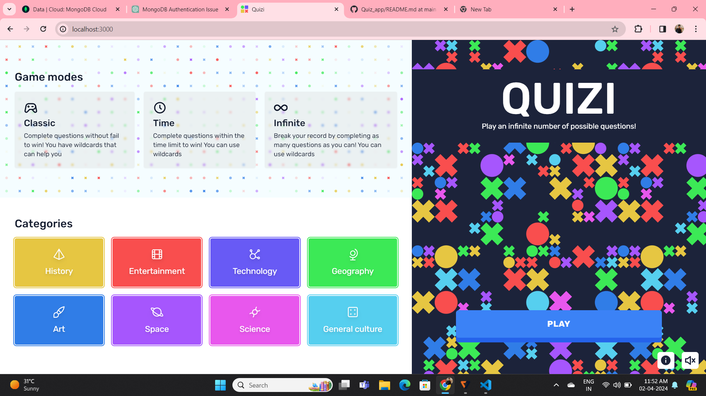
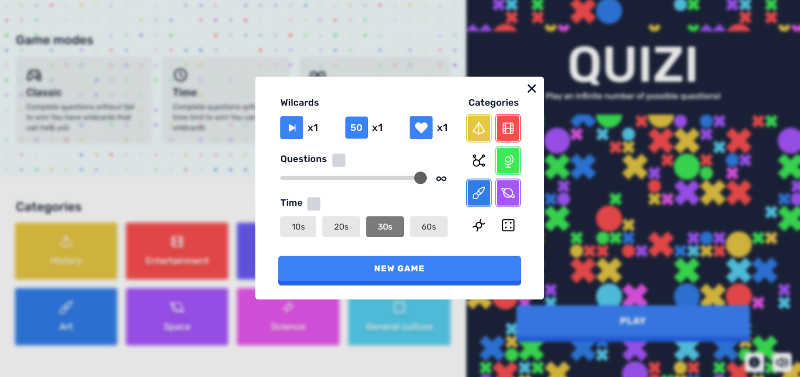
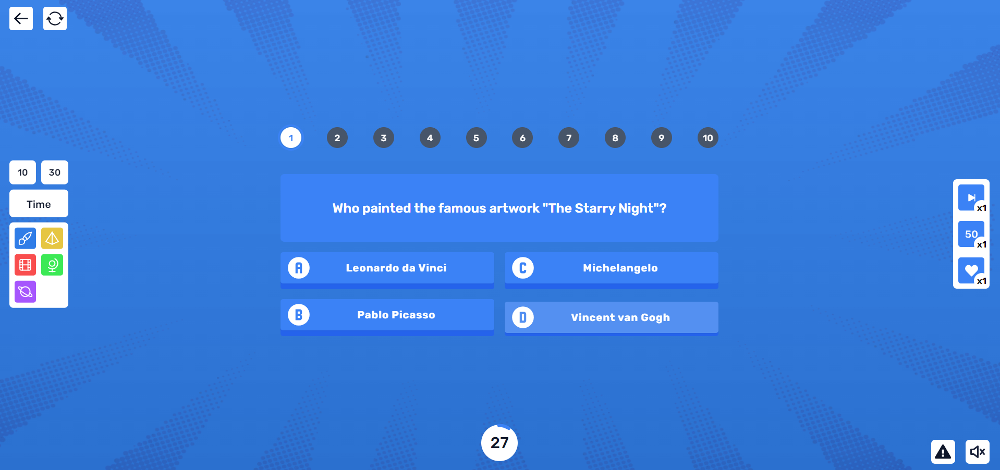
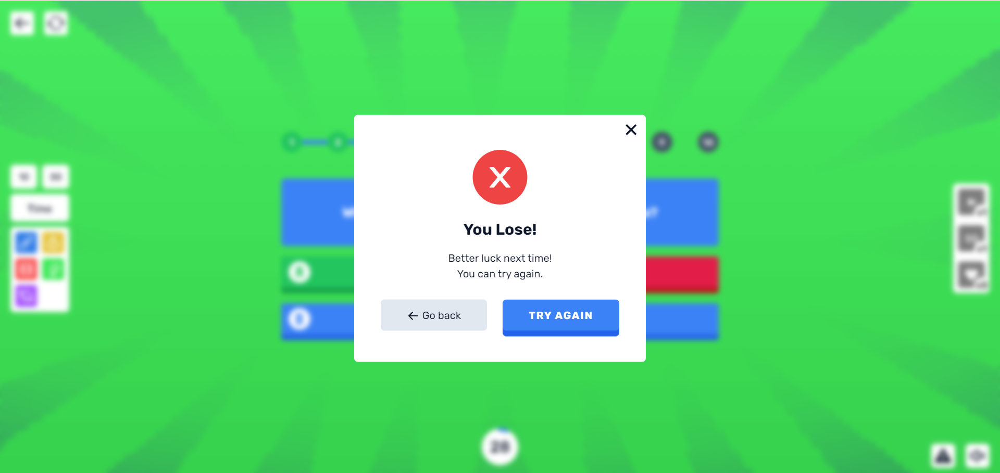

Designed and Developed by Mohammed Anas A
Email: mdanas2k3@gmail.com

# Welcome to our Quiz Application!
This interactive web application allows users to participate in various quizzes covering a wide range of topics. Whether you're looking to test your knowledge, study for an exam, or simply have some fun, our Quiz Application provides an engaging platform to challenge yourself and learn something new.

# Features
User-friendly Interface: Our application boasts an intuitive and easy-to-use interface, making it accessible to users of all ages and backgrounds.

# Diverse Quiz Categories
Choose from a diverse range of quiz categories, including but not limited to science, history, mathematics, literature, and more. With new quizzes added regularly, there's always something new to explore.

# Customizable Settings
Tailor your quiz-taking experience to suit your preferences. Adjust settings such as quiz duration, difficulty level, and question format to personalize your learning journey.

# Real-time Feedback
Receive instant feedback on your quiz performance, including correct answers, incorrect responses, and overall scores. Track your progress over time and strive for improvement.

# Comprehensive Reporting
Upon completing a quiz, users receive detailed reports summarizing their performance, including the number of correct and incorrect answers, pass/fail status, and more.

# Responsive Design
Our application is designed to be fully responsive across all devices, ensuring a seamless user experience whether you're accessing it from a desktop computer, tablet, or smartphone.

# Getting Started
To get started with our Quiz Application, simply visit our website and create an account to access a wide range of quizzes. Once logged in, browse through the available categories, select a quiz that interests you, and begin testing your knowledge!

# Contributing
We welcome contributions from the community to enhance and improve our Quiz Application. Whether you're a developer interested in contributing code, a designer with creative ideas for improving the user interface, or a user with feedback on how we can make the application better, we value your input. Please refer to our Contributing Guidelines for more information on how to get involved.

.
.
.
.
